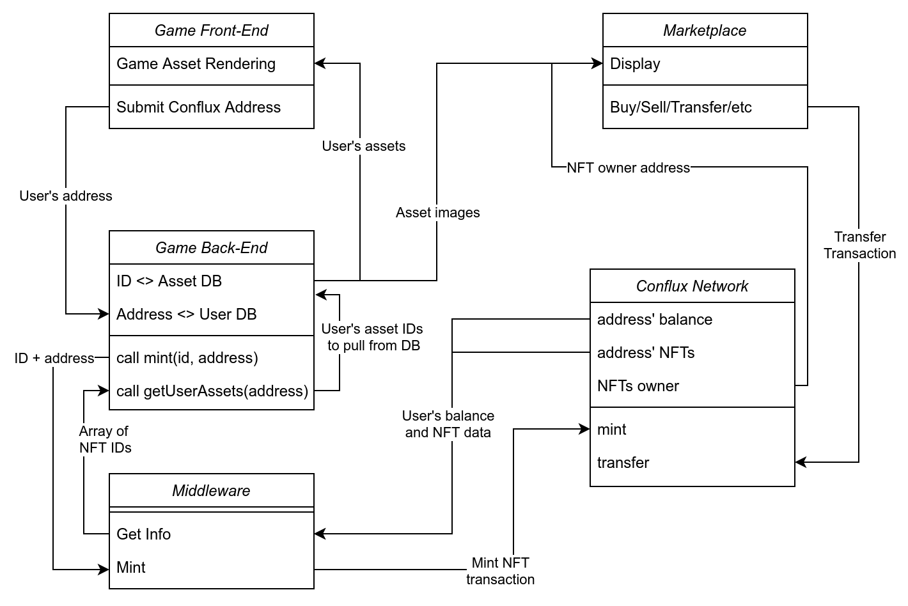

# Sponsored ERC721

Repository for the basic tools in javascript and golang for integrating Conflux Network NFTs (ERC-721) into applications. The following details how to mint, get address NFT ids, and set up transaction sponsorship (optional).



The above illustrates a basic PoC of integrating NFTs into a game. The game only need to track the user's address in their account. The backend needs to interface with the Conflux Network blockchain to send/mint assets for each user, and also retrieve data. The marketplace for trading assets can be handled by third-party marketplaces that aggregate NFTs/game assets from any game - which is the unique functionality that blockchain enables: cross-game assets.

This repository details the middleware layer of providing easy to use/integrate functions for games to connect NFTs to a game.

## Contract
ERC721 Contract from [OpenZeppelin](https://docs.openzeppelin.com/contracts/3.x/) with slight modification to expose the mint functionality:
```solidity
// SPDX-License-Identifier: WTFPL

pragma solidity ^0.6.0;

import "@openzeppelin/contracts/token/ERC721/ERC721.sol";

contract NFTBase is ERC721 {
    address private owner;

    constructor() ERC721("MyCollectible", "MCO") public {
      owner = msg.sender;
    }

    //exposing the safe mint function
    function safeMint(address to, uint256 tokenId) public {
      require(msg.sender == owner, "NFTBase: Only owner can mint");
      _safeMint(to, tokenId);
    }

    function safeMint(address to, uint256 tokenId, bytes calldata _data) public {
      require(msg.sender == owner, "NFTBase: Only owner can mint");
      _safeMint(to, tokenId, _data);
    }

}
```

Then the contract is:
* Compiled using conflux-truffle (`cfxtruffle compile`)
* ABI/bytecode used for deployment

## Deploy
Javascript files for deploying NFT contract and setting up transaction sponsorship.

Function | Details
--|--
`node deploy <KEY_ENV>` | Deploy the corresponding ERC721 contract to Conflux testnet
`node sponsor <KEY_ENV> <CONTRACT_ADDR>`| Send CFX as sponsor for gas and collateral
`node checkSponsor <CONTRACT_ADDR>` | Check sponsorship parameters of contract address
`node addSponsored <KEY_ENV> <CONTRACT_ADDR> <SPONSORED_ADDR>` | Admin can add an address as a sponsored address for smart contract interaction
`node isSponsered <CONTRACT_ADDR> <USER_ADDR>` | Check if user is sponsored for the smart contract
`node destroy <KEY_ENV> <CONTRACT_ADDR>` | Destroy the contract and unstake storage collateral (only contract admin can call)


#### Example
Sample `.env` file:
```
ENDPOINT=http://test.confluxrpc.org
PRIVATE_KEY1=0x<private_key>
PRIVATE_KEY2=0x<private_key>
```

Sample function calls:
```
//for deploying contract
node deploy PRIVATE_KEY1
node sponsor PRIVATE_KEY2 0x8aa092e0660c59eab456efdbd39ae8d158e9a95b
node checkSponsor 0x8aa092e0660c59eab456efdbd39ae8d158e9a95b
node addSponsored PRIVATE_KEY1 0x8aa092e0660c59eab456efdbd39ae8d158e9a95b 0x15fd1E4F13502b1a8BE110F100EC001d0270552d
node isSponsored 0x8aa092e0660c59eab456efdbd39ae8d158e9a95b 0x15fd1E4F13502b1a8BE110F100EC001d0270552d

//for destroying contract
node destroy PRIVATE_KEY1 0x8aa092e0660c59eab456efdbd39ae8d158e9a95b
```
Note: `PRIVATE_KEY1` is the creator of the contract and is the default admin, so it is used in the `addSponsored` command. `PRIVATE_KEY2` is used to represent any sponsor.

Contract address (testnet): 0x8aa092e0660c59eab456efdbd39ae8d158e9a95b

#### Resources
Sponsorship contract interface: https://github.com/Conflux-Chain/conflux-rust/blob/master/internal_contract/contracts/SponsorWhitelistControl.sol  
Documentation: https://developer.conflux-chain.org/docs/conflux-rust/internal_contract/internal_contract#sponsorwhitelistcontrol-contract

## Packages
Once the previous steps are followed to deploying a smart contract, the following packages in go or javascript can be used to interact with the contract to mint and read data.

All packages follow the same basic format for functions (Note: Function capitalization may be different depending on the package. See examples for usage):

Name | Input | Output | Functionality
 -- | -- | -- | --
 _`constructor`_ | `endpoint`, `NFT address` | `nft object` | Constructor for creating the NFT instance for use |
 `mint` |  `user address`, `nft ID` | `transaction hash` | Mint NFT (of specific ID) to a user's wallet
 `getAssets` | `user address` | `array of nft IDs` | Get a list of NFT IDs for the specific user

A `.env` file is required to provide the Conflux Network private key for the NFT smart contract deployer.
```
PRIVATE_KEY=<insert-private-key>
```

### Javascript
```
yarn add @aalu1418/sponsored-erc721
```
[Example + Usage](./examples/js/example.js)

### Go
```
go get github.com/Conflux-Network-Global/sponsored-erc721/golang
```
[Example + Usage](./examples/go/example.go)

### Other Languages
There is plenty of room for improvement!
* Python
* .NET
* C++
* etc
